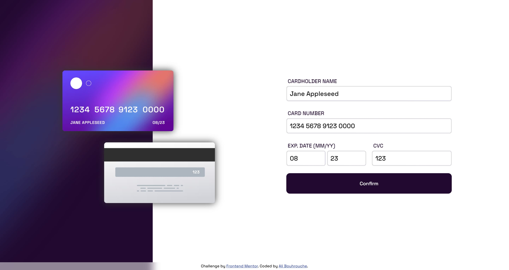

# Frontend Mentor - Interactive card details form solution

This is a solution to the [Interactive card details form challenge on Frontend Mentor](https://www.frontendmentor.io/challenges/interactive-card-details-form-XpS8cKZDWw). Frontend Mentor challenges help you improve your coding skills by building realistic projects. 

## Table of contents

- [Overview](#overview)
  - [The challenge](#the-challenge)
  - [Screenshot](#screenshot)
  - [Links](#links)
- [My process](#my-process)
  - [Built with](#built-with)
  - [What I learned](#what-i-learned)
- [Author](#author)

## Overview

### The challenge

Users should be able to:

- Fill in the form and see the card details update in real-time
- Receive error messages when the form is submitted if:
  - Any input field is empty
  - The card number, expiry date, or CVC fields are in the wrong format
- View the optimal layout depending on their device's screen size
- See hover, active, and focus states for interactive elements on the page

### Screenshot

### Links

- Solution URL: https://github.com/alibouhrouche/interactive-card-details-v1
- Live Site URL: https://alibouhrouche.github.io/interactive-card-details-v1/

## My process

### Built with

- Flexbox
- CSS Grid
- Mobile-first workflow
- [React](https://reactjs.org/) - JS library
- [Vite](https://vitejs.dev/) - Build tool
- [Emotion](https://emotion.sh/) - For styles

### What I learned

I learned how to use storybook to help with building the UI.
And how to make the card text the same size while resizing using SVG.

## Author

- Website - [Ali Bouhrouche](https://ali.js.org)
- Frontend Mentor - [@alibouhrouche](https://www.frontendmentor.io/profile/alibouhrouche)
- Twitter - [@alibouhrouche](https://twitter.com/alibouhrouche)
